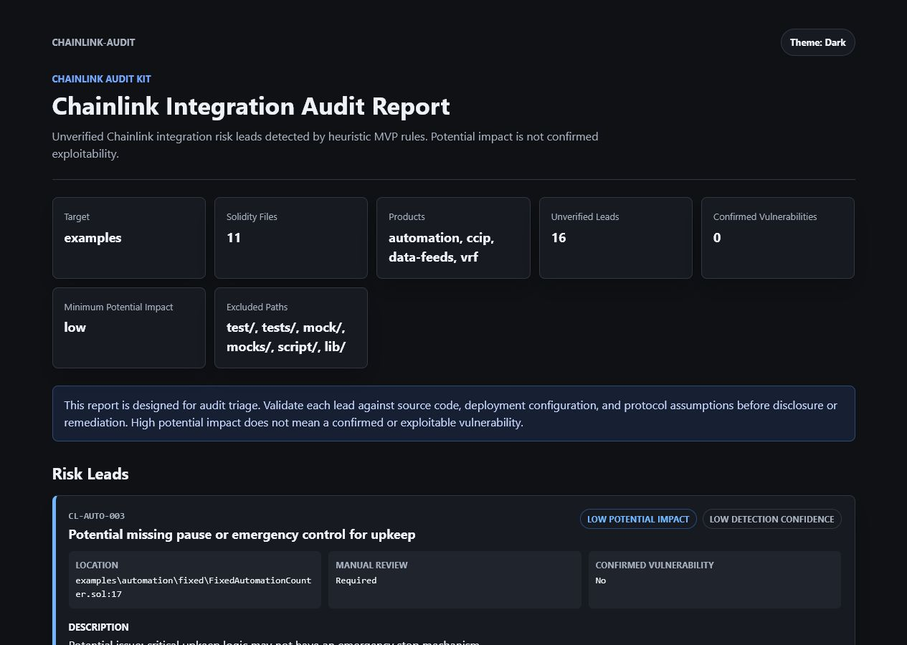

# Chainlink Audit Kit

[](https://www.npmjs.com/package/chainlink-audit)
[](https://github.com/alva-p/chainlink-integration-audit-kit/actions/workflows/ci.yml)

Security CLI for Chainlink-powered Solidity contracts. Scans repositories for risky integration patterns across Data Feeds, CCIP, VRF, Automation, and Functions/CRE and surfaces unverified risk leads for manual review.

## Install

```bash
npm install -g chainlink-audit
```

## Usage

```bash
chainlink-audit scan .                                        # text output
chainlink-audit scan . --format markdown --out report.md     # markdown
chainlink-audit scan . --format html --out report.html       # HTML report
chainlink-audit scan . --format sarif --out report.sarif     # SARIF (CI)
chainlink-audit scan . --min-severity medium                 # filter by severity
chainlink-audit scan . --fail-on high                        # exit 1 on high leads (CI)
chainlink-audit scan . --changed-since origin/main           # only changed .sol files
chainlink-audit baseline .                                   # accept current leads
chainlink-audit triage report.json --out triage.md          # review checklist
chainlink-audit rules                                        # list all rules
chainlink-audit init                                         # create config file
```

## CI / Continuous Control

Adopt the scanner on an existing repo without failing on day one:

1. `chainlink-audit baseline .` records current leads in `.chainlink-audit-baseline.json` (commit it). Future scans only report **new** leads. Fingerprints anchor on line content, so unrelated edits don't invalidate the baseline.
2. Suppress individual leads inline with a reason:

```solidity
// chainlink-audit-ignore: CL-CCIP-004 -- sender is validated in GlacisAbstractAdapter
(address to, uint256 amount) = abi.decode(message.data, (address, uint256));
```

A bare `// chainlink-audit-ignore` suppresses all rules on that line; listing rule IDs suppresses only those. Both forms work on the flagged line or the line above.

3. Gate PRs with the GitHub Action:

```yaml
- uses: alva-p/chainlink-integration-audit-kit@main
  with:
    fail-on: high
- uses: github/codeql-action/upload-sarif@v3
  if: always()
  with:
    sarif_file: chainlink-audit.sarif
```

## Verifying Leads with an Agent

The scanner is regex-based and over-reports by design. [`.claude/agents/chainlink-verify.md`](.claude/agents/chainlink-verify.md) is a [Claude Code](https://claude.ai/code) agent that reads each lead's full cross-file context (parent contracts, inherited modifiers, delegated helpers) and classifies it as **CONFIRMED**, **FALSE POSITIVE** (with the refuting line), or **NEEDS-CONTEXT** — including ready-to-paste suppression comments for false positives.

Copy it into your repo's `.claude/agents/` and ask Claude Code: *"verify the chainlink-audit report"*.

## What It Detects

| Product | Rules | Examples |
|---|---|---|
| **CCIP** | 11 | Missing source chain / sender / router validation, unsafe payload decoding, Token Pool validator bypass, unknown chain selector |
| **Data Feeds** | 10 | Stale price, missing validity checks, deprecated `latestAnswer()`, registry-verified addresses/decimals/deprecation |
| **Data Streams** | 3 | Missing report verification, missing timestamp validation |
| **VRF** | 4 | Untracked requests, missing fulfillment guard, weak randomness use |
| **Automation** | 3 | Missing `performUpkeep` revalidation, selector mismatch |
| **Functions/CRE** | 3 | Hardcoded secrets, inline source assumptions |

### Registry-verified checks

Four rules validate hardcoded values against **Chainlink's official registries** (reference data directory + `chain-selectors`), pinned at build time — 1,500+ feeds across 14 chains and all official CCIP chain selectors:

- **CL-DF-008** — hardcoded aggregator address not found in the official feed registry (mistyped, retired, or third-party)
- **CL-DF-009** — code scales with an 8-decimal assumption but the registry says the feed has different decimals
- **CL-DF-010** — feed is flagged `deprecating` in the registry and will stop updating
- **CL-CCIP-011** — hardcoded chain selector doesn't match any official CCIP selector

These checks compare against ground truth rather than code patterns, so they can produce concrete, verifiable findings. Refresh the snapshot with `npm -w packages/cli run update-registry`.

## Example Output

```
Chainlink Integration Audit Kit
Target: .
Solidity files scanned: 11
Detected Chainlink products: ccip, data-feeds, vrf
Unverified leads: 14

[HIGH POTENTIAL IMPACT] CL-CCIP-001 - Potential CCIP receive without source chain validation
  Detection confidence: medium
  Location: src/Receiver.sol:28
  Risk: Cross-chain spoofing or misrouted messages can trigger unauthorized state changes.
  Recommendation: Validate message.sourceChainSelector against an explicit allowlist.
  Manual review required: yes
```



## Configuration

```bash
chainlink-audit init
```

Creates `.chainlink-audit.json` in the project root:

```json
{
  "exclude": ["test/", "tests/", "mock/", "mocks/", "script/", "lib/"],
  "format": "text",
  "minSeverity": "low"
}
```

CLI flags override config values for that run.

## Interpreting Results

Every finding is an **unverified risk lead**, not a confirmed vulnerability. Severity reflects potential impact if the lead is real. False positives are expected in abstract base contracts, mocks, and code with custom validation patterns.

Use `chainlink-audit triage <report.json>` to generate a manual review checklist with status fields for each lead.

## Ecosystem Benchmark

The CLI package includes a pinned benchmark manifest for public repositories listed in the [Chainlink Ecosystem](https://www.chainlinkecosystem.com/ecosystem), excluding the original seven-repository manual audit sample.

```bash
npm -w packages/cli run benchmark:ecosystem -- --out ../../cache/ecosystem-benchmark-report.json
```

The runner clones pinned commits into `cache/ecosystem-benchmark`, scans each checkout, and writes aggregate per-project and per-rule lead counts.

### Precision (registry rules)

Every finding is an unverified lead, but some rules are noisier than others and we
publish it rather than hide it. Manual triage of the registry-verified rules against
the 60-repo benchmark ([full triage](docs/benchmark-triage.md)):

| Rule | Fired | Actionable | Note |
|------|-------|-----------|------|
| CL-DF-008 | 10 | 0 | Interface is shared with non-Chainlink oracles → **low** severity |
| CL-DF-009 | 1 | 0 | 8-decimal factor may scale a different token → **low** confidence |
| CL-DF-010 | 0 | — | No noise; genuinely actionable when it fires |
| CL-CCIP-011 | 0 | — | No noise; genuinely actionable when it fires |

Severities in v0.6.1 are calibrated from these measured base rates.

## Install From Source

```bash
git clone https://github.com/alva-p/chainlink-integration-audit-kit.git
cd chainlink-integration-audit-kit
npm install && npm run build
node packages/cli/dist/index.js scan examples
```

## Limitations

- Pattern matching only — no AST or dataflow analysis.
- No RPC calls or live contract state checks.
- No proof of exploitability.

## Security

See [`SECURITY.md`](SECURITY.md) and [`docs/disclosure-policy.md`](docs/disclosure-policy.md).
